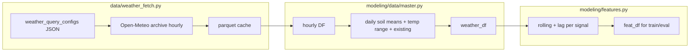

# Plan: Soil moisture, daily temperature range, and rolling features

## How this maps to your codebase

The project already uses **window + lag** pairs for weather-derived signals: `[d_p`/`l_p](configs/features/default.yaml)` (precip), `[d_s`/`l_s](configs/features/default.yaml)` (snow), `[d_f`/`l_f](configs/features/default.yaml)` (freeze–thaw). Your “each variable gets its own d_feature and l_feature” maps to **four new pairs** (three soil series + one temperature-range series), following the same naming style.

Daily rolling behavior today is in `[modeling/features.py](modeling/features.py)`: precip uses `rolling(d).sum()`, snow uses `rolling(d).mean()`, FTC uses `rolling(d).sum()`. For soil moisture and diurnal temperature range, **rolling mean** (aligned with snow) is the natural default; you can switch to sum for a specific series if you prefer.

**Daily temperature range** does not require new API fields: `[_aggregate_to_daily](modeling/data/master.py)` already computes `tmax_c` and `tmin_c` from hourly `temperature_2m`. The daily range is `tmax_c - tmin_c` (equivalent to max(hourly) − min(hourly) per calendar day in that resample).

---

## 1. Weather query function and fetch path (`[data/weather_fetch.py](data/weather_fetch.py)`)

**Problem today:** `[get_hourly_weather](data/weather_fetch.py)` hardcodes `hourly: ["temperature_2m", "precipitation", "snow_depth"]` and builds the DataFrame with fixed `Variables(0..2)`. `[fetch_and_save](data/weather_fetch.py)` and `[load_or_fetch](data/weather_fetch.py)` ignore `config["variables"]` when calling `get_hourly_weather`.

**Changes:**

1. **Extend the default variable list** (e.g. append Open-Meteo hourly names):
  - `soil_moisture_0_to_7cm`, `soil_moisture_7_to_28cm`, `soil_moisture_28_to_100cm`
  - *Verify* these exact names against [Open-Meteo Historical Weather API](https://open-meteo.com/en/docs/historical-weather-api) (ERA5 hourly variables); names must match the API for the archive endpoint you use.
2. **Refactor `get_hourly_weather`** to accept `variables: list[str]` and build the response DataFrame by iterating `hourly.Variables(i)` for `i in range(len(variables))`, with columns named exactly as requested (same pattern as today, but length-general).
3. **Thread variables through callers:**
  - `fetch_and_save`: `get_hourly_weather(lat, lon, start, end, variables=config.get("variables", DEFAULT_VARIABLES))`
  - `load_or_fetch`: same when fetching after a cache miss.
4. **Cache / staleness:** Cache files are keyed only by `label` (ward + dates). If you add columns but keep the same `label`, **existing parquet will be reused** and stay column-poor. Document the workflow: update JSON `variables` → delete the corresponding `.parquet` (or add a `force=True` path you already have in `fetch_and_save`) → re-fetch. Optionally extend metadata comparison to warn when `variables` in JSON ≠ `variables` stored in metadata (if you persist them in `_metadata.json`).

---

## 2. Weather query JSON configs (`[data/weather_query_configs/*.json](data/weather_query_configs)`)

- Add the three soil variables to the `variables` array for each ward/range you care about (e.g. `[weather_ward3_20200601_20251231.json](data/weather_query_configs/weather_ward3_20200601_20251231.json)`), or regenerate via `[write_query_config](data/weather_fetch.py)` with an explicit `variables=` list.
- Re-run `fetch_and_save(..., force=True)` (or delete cache + fetch) so parquet includes new columns.

---

## 3. Daily pipeline (`[modeling/data/master.py](modeling/data/master.py)`)

`**_aggregate_to_daily`:**

- Keep existing `tmax_c` / `tmin_c` aggregation.
- Add `daily_temp_range_c = tmax_c - tmin_c` (or a short name like `temp_range_c`) before dropping intermediate columns.
- For each soil column present in `df_hourly`, aggregate with **daily mean** (parallel to `snow_depth` → `mean`): e.g. map API names to stable internal names such as `daily_soil_0_7`, `daily_soil_7_28`, `daily_soil_28_100`.

`**build_daily`:**

- Pass these new daily columns through into `weather_df` alongside `daily_precip`, `daily_snow`, `daily_ftc`, calendar features.
- **Backward compatibility:** If hourly parquet lacks soil columns (old cache), skip adding those daily columns so downstream code can branch on column presence.

---

## 4. Feature assembly (`[modeling/features.py](modeling/features.py)`)

**New hyperparameters** (example names—pick one scheme and use everywhere):

| Signal         | Suggested `d_*` / `l_*`  | Rolling column name (example) |
| -------------- | ------------------------ | ----------------------------- |
| Soil 0–7 cm    | `d_sm07`, `l_sm07`       | `soil07_roll`                 |
| Soil 7–28 cm   | `d_sm728`, `l_sm728`     | `soil728_roll`                |
| Soil 28–100 cm | `d_sm28100`, `l_sm28100` | `soil28100_roll`              |
| Temp range     | `d_tr`, `l_tr`           | `temp_range_roll`             |

Implementation pattern (same block as `precip_roll` / `snow_roll` / `ftc_roll`):

- Copy `weather_df`, compute each roll only if the underlying daily column exists.
- Use `getattr(p, "d_sm07", <default>, ...)` **or** explicit defaults so **old saved `feat_params`** (from `[modeling/train.py](modeling/train.py)` / pickle) still load; combined with **column missing** checks, old evaluation runs stay valid.
- Drop raw daily weather columns used only for rolls after computing rolls (extend the existing `drop(columns=...)` pattern).

**Saved models:** `[modeling/evaluate.py](modeling/evaluate.py)` subsets `X_test` with `feature_cols` from the pickle; extra columns in `feat_df` do not break old models. New training runs will pick up new columns via `feature_cols = [c for c in feat_df.columns if c not in ("date", "Y", "split")]`.

---

## 5. Hydra configs

- `**[configs/features/default.yaml](configs/features/default.yaml)`:** Add the eight new integers with conservative defaults (e.g. mirror `d_s`/`l_s` defaults).
- `**[configs/features/best_*.yaml](configs/features/features)`:** Add the same keys so resolved configs stay complete (copy values from `default` until you re-tune).
- `**[configs/sweep/feature_params.yaml](configs/sweep/feature_params.yaml)`:** Add Bayesian search ranges for each new `d_`* and `l_`* (same min/max style as existing params).

---

## 6. Search / sweep code paths (must stay in sync)

These files **hardcode** feature parameter names; extend them in parallel:

- `[modeling/search/sweep.py](modeling/search/sweep.py)` — `feature_names = [...]`
- `[modeling/search/grid.py](modeling/search/grid.py)` — `param_names` and `[configs/search/grid.yaml](configs/search/grid.yaml)` candidate lists (grid explodes combinatorially—consider **fixed** values for new params initially to avoid a huge Cartesian product, or narrow ranges).

`[modeling/search/bayes.py](modeling/search/bayes.py)` passes `SimpleNamespace(**params)` through; ensure whatever produces `params` includes the new keys if you use custom YAMLs there.

---

## 7. Integration diagram

---

## 8. Optional follow-ups (out of minimal scope)

- **Notebook / docs:** Any notebook that assumes only three hourly columns should be updated once parquet schema grows.
- `**train.py`:** There are several `breakpoint()` calls in the current file; unrelated to this feature work but they will interrupt runs until removed.

---

## Implementation order (recommended)

1. Refactor `get_hourly_weather` + wire `variables` in `fetch_and_save` / `load_or_fetch`; extend `DEFAULT_VARIABLES`.
2. Update one JSON config + re-fetch with `force=True`; confirm parquet columns locally.
3. Extend `_aggregate_to_daily` and `build_daily`.
4. Extend `assemble_features` + `configs/features/default.yaml`.
5. Update sweep/grid/best YAMLs and search scripts.

