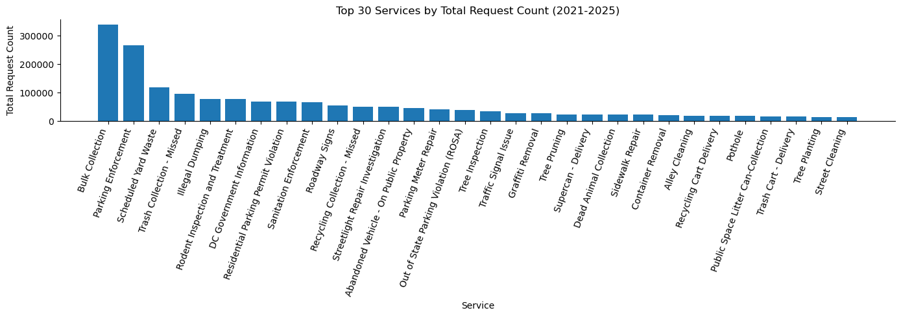
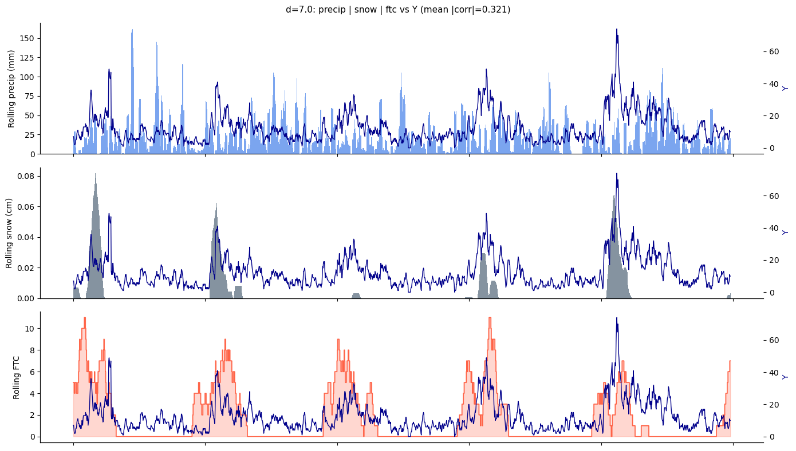

# DC 311 Pothole Forecasting

Potholes are a comon urban infrastructure issue, and timely repair is critical for public safety and satisfaction. The DC 311 service request system provides a rich dataset of pothole reports, which can be used to predict future demand for repairs. This project focuses on forecasting the number of pothole repair requests in Washington, DC using historical 311 data and weather information.

### Problem Statement
Given a date $t$, predict the number of pothole requests expected over the next $d$ days using information available up to $t$ (including lagged weather and historical request behavior).

### Primary KPIs and Stakeholders
- **KPIs**:
- MAE (mean absolute error)
- RMSE (root mean squared error)
- Poisson deviance (count-aware error metric)
- Correlation between predictions and true counts (used in some EDA/model-comparison workflows)

- **Stakeholders**:
- DC Department of Public Works (DPW) - for resource allocation and scheduling
- DC residents - for improved service and communication
- City planners - for infrastructure maintenance planning

## Exploratory Data Analysis

### 1. Data Acquisition

We use two primary data sources:

1. DC 311 service request data (pothole-specific)
2. Historical weather data from Open-Meteo

The DC 311 data is accessed from the (Open Data DC)[https://opendata.dc.gov/datasets/] portal, which provides annual CSV exports of all service requests. We filter to those with `SERVICECODEDESCRIPTION == "Pothole"` to get the pothole data. We found that the serivce requests baselines differed significantly across wards, leading us to focus on DC's Ward 3, which has the largest number of pothole service requests.




Raw DC 311 CSV files are expected as annual exports (for example, in a local `csv_data/` folder or another user-provided path). The preprocessing entrypoint is:
- `data/preprocess_311.py`
- function: `preprocess_311(...)`

What it does:
- reads one or multiple raw CSVs,
- filters to `SERVICECODEDESCRIPTION == "Pothole"`,
- validates required columns,
- writes per-ward parquet files to `data/311_data/`,
- returns ward centroids for downstream weather querying.

Example:
```python
from data.preprocess_311 import preprocess_311

out = preprocess_311(
    raw_csv=[
        "csv_data/All_Service_Requests_-_2021.csv",
        "csv_data/311_City_Service_Requests_in_2022.csv",
        "csv_data/All_Service_Requests_-_2023.csv",
    ],
    out_dir="data/311_data",
)
```

For the weather data, we use the Open-Meteo archive API to retrieve historical hourly weather data for the relevant locations and time periods. Since we are interested in the cumulative effect of weather conditions over time, we aggregate the hourly data into daily features. Moreover, we query the weather for the geographical centroid of the ward, which is computed as part of the output of `preprocess_311.py`. The historical weather API allows for the extraction of various weather variables--we extract precipitation, snowfall, and freeze-thaw counts, which are commonly associated with pothole formation and repair demand. The weather retrieval process is designed to be modular and reusable, with query specifications saved as JSON files for reproducibility and caching of results to avoid redundant API calls. A minimal working code snippet is below: 

```python
from data.weather_fetch import write_query_config, fetch_and_save
out = preprocess_311(
    raw_csv=[
        "csv_data/All_Service_Requests_-_2021.csv",
        "csv_data/311_City_Service_Requests_in_2022.csv",
        "csv_data/All_Service_Requests_-_2023.csv",
    ],
    out_dir="data/311_data",
)
cfg_path = write_query_config(
    ward="Ward 3",
    lat=38.92,
    lon=-77.08,
    start_date="2020-12-01",  # buffer period for lag features
    end_date="2025-12-31",
    configs_dir="data/weather_query_configs",
)
df_hourly, meta = fetch_and_save(
    cfg_path,
    cache_dir="data/weather_cache",
    force=False,
)
```

### 1c) Rolling and lagged feature implementation
Rolling and lagged weather features are implemented in:
- `modeling/features.py` (`assemble_features`)

Core transforms:
- `precip_roll = rolling(d_p).sum().shift(l_p)`
- `snow_roll   = rolling(d_s).mean().shift(l_s)`
- `ftc_roll    = rolling(d_f).sum().shift(l_f)`

Daily weather and seasonal/date features are prepared in:
- `modeling/data/master.py` (`build_daily`)

Freeze-thaw counts are built from hourly runs, then aggregated daily.

### 2. Data Exploration

In order to build features from the weather data using the lagged and rolling transformations, we write a flexible feature assembly function that takes in the raw weather data and applies the specified rolling and lag parameters to create the `precip_roll`, `snow_roll`, and `ftc_roll` features. This function is designed to be modular, allowing for easy experimentation with different parameter values during the EDA phase. The core logic of this feature generation process is encapsulated in the `assemble_features` function within `modeling/features.py`. We also include time series features using a trigonometric encoding of the day of year and day of week indicators, which are implemented in `modeling/data/master.py` as part of the daily feature building process. We also aimed to make our models autoregressive--i.e to use past counts to predict the current counts. We discuss the issues with data leakage and the approach we took to mitigate it in the section below. Our models therefore predict the $d$-day cumulative count of pothole requests $Y^{d}_{t}$ at date $t$, using weather features $X_{t}$, temporal features $\tau_{t}$ and past values of the target variable $Y^{d}_{t-1}, Y^{d}_{t-2}, ..., Y^{d}_{t-k_{AR}}$ as inputs. In particular, we find that the choice of lag and window parameters for the rolling weather features has a significant impact on their correlation with the target pothole counts. To systematically explore this, we perform a small grid-based optimization over a small grid of lag and window parameters to identify which combinations yield the strongest mean absolute correlation with the target variable.



We comment on the limitations of this process in the limitations section below, but it serves as a critical step in guiding our feature selection and engineering for the modeling phase.

### 3. Modeling and model selection 

We consider three main families of models for forecasting pothole requests:

1. Generalized Linear Models (GLMs) for count data, including Poisson and Negative
Binomial variants.

2. XGBoost with a Poisson objective

3. A hybrid XGB-SARIMA model that trains an XG Boost model and then fits a SARIMA model to the residuals to capture any remaining temporal autocorrelation.

#### A note on hyperparameter tuning 

We have 7 main hyperparameters to tune for the data, given by the rolling window size of each weather feature (total precipitation, total FTC's, mean snowfall) and the size of the autoregressive window. We additionally want to train a new model for each forecast horizon (1-day, 3-day, 7-day cumulative counts), which may have different optimal hyperparameters. This leads to a combinatorial explosion of hyperparameter combinations--to circumvent this we use Bayesian optimization to efficiently optimize over the hyperparameter space. In particular, we use the in-built Bayesian optimizer in the Weights & Biases library, which allows us to easily track and compare different runs with different hyperparameter settings. The optimization process is configured in `modeling/search/sweep.py`, where we define the search space for the hyperparameters and the objective function that evaluates model performance based on the chosen KPIs. 

**WARNING** You must have a WandB account and API key to run the Bayesian optimization sweep. You can set up a free account at https://wandb.ai/site and get your API key from your account settings. Once you have your API key, you can set it in your environment variables or directly in the code to enable the sweep functionality. We assume that you have set up your WandB account and API key correctly before running the sweep. If you encounter any issues with WandB integration, please refer to the WandB documentation for troubleshooting steps. In WandB, we first initialize the sweep using the sweep configuration found in `configs/sweep/feature_params.yaml` and then launch a sweep agent (a bunch of parallel processes) that performs the hyperparameter search. A small snippet of code that achieves this is below: 

```bash
wandb sweep configs/sweep/feature_params.yaml --name {YOUR_SWEEP_NAME}
```
After executing this, you get a sweep ID in the output, which you can use to launch the sweep agent:
```bash
python3 modeling/search/sweep.py +sweep_run=default sweep_run.sweep_id{YOUR_SWEEP_ID}
```


#### Best Hyperparameters by Model and Forecast Horizon

The optimal feature engineering hyperparameters identified through Bayesian search for each model and forecast horizon ($d$) are summarized below:

| Model | d | d_f | d_p | d_s | k_AR | l_f | l_p | l_s |
|-------|---|-----|-----|-----|------|-----|-----|-----|
| GLM Negative Binomial | 1 | 7 | 14 | 18 | 0 | 1 | 1 | 8 |
| GLM Negative Binomial | 5 | 11 | 9 | 17 | 0 | 10 | 6 | 9 |
| GLM Negative Binomial | 7 | 9 | 19 | 19 | 0 | 10 | 8 | 10 |
| GLM Poisson | 1 | 7 | 19 | 20 | 0 | 1 | 1 | 10 |
| GLM Poisson | 5 | 9 | 15 | 20 | 0 | 8 | 10 | 10 |
| GLM Poisson | 7 | 18 | 12 | 19 | 0 | 7 | 6 | 6 |
| XGBoost | 1 | 21 | 8 | 8 | 8 | 1 | 9 | 7 |
| XGBoost | 5 | 8 | 7 | 9 | 0 | 10 | 9 | 5 |
| XGBoost | 7 | 16 | 12 | 19 | 0 | 7 | 2 | 9 |
| XGBoost SARIMAX | 1 | 21 | 8 | 14 | 10 | 10 | 9 | 10 |
| XGBoost SARIMAX | 5 | 8 | 21 | 7 | 0 | 9 | 10 | 1 |
| XGBoost SARIMAX | 7 | 11 | 9 | 20 | 0 | 5 | 9 | 10 |

**Hyperparameter Definitions:**
- **d**: Forecast horizon in days
- **d_f**: Rolling window size for freeze-thaw count features (days)
- **d_p**: Rolling window size for precipitation features (days)
- **d_s**: Rolling window size for snowfall features (days)
- **k_AR**: Autoregressive lag window size (number of prior days used as features)
- **l_f**: Lag offset for freeze-thaw count features (days)
- **l_p**: Lag offset for precipitation features (days)
- **l_s**: Lag offset for snowfall features (days)

#### b. Autoregressive prediction 
#### Model Performance Results

Test set performance across all models and forecast horizons:

**Results for d=1 (1-day forecast)**
### Training
| Model | MAE | RMSE | Rel. MAE (%) | Rel. RMSE (%) | Poisson Deviance | Correlation |
|-------|-----|------|--------------|---------------|---------------------|------------|
| GLM Negative Binomial | 1.3525 | 1.85 | 0.488 | 0.5542 | 1.8282 | 0.4859 |
| GLM Poisson | 1.3641 | 1.8761 | 0.4897 | 0.5569 | 1.8747 | 0.4474 |
| XGBoost | 1.3852 | 1.9379 | 0.4991 | 0.5841 | 2.1971 | 0.4034 |
| XGBoost SARIMAX | 1.4025 | 1.9684 | 0.5089 | 0.6138 | 2.3055 | 0.3473 |
```bash
**Results for d=5 (5-day forecast)**
python3 -m modeling.train --config-name first_try \
| Model | MAE | RMSE | Rel. MAE (%) | Rel. RMSE (%) | Poisson Deviance | Correlation |
|-------|-----|------|--------------|---------------|---------------------|------------|
| GLM Poisson | 4.837 | 6.5543 | 0.4744 | 0.6559 | 4.4537 | 0.6164 |
| GLM Negative Binomial | 4.8353 | 6.5567 | 0.4752 | 0.6577 | 4.4273 | 0.6289 |
| XGBoost SARIMAX | 4.8113 | 6.4203 | 0.5052 | 0.7728 | 4.4361 | 0.6233 |
| XGBoost | 5.0324 | 6.7125 | 0.5126 | 0.722 | 5.2522 | 0.5882 |
  ++ward.raw_311='data/311_data/ward3_potholes_20210101_20251231.parquet' \
**Results for d=7 (7-day forecast)**
  ++ward.weather_cache='data/weather_cache/weather_ward3_20200601_20251231.parquet' \
| Model | MAE | RMSE | Rel. MAE (%) | Rel. RMSE (%) | Poisson Deviance | Correlation |
|-------|-----|------|--------------|---------------|---------------------|------------|
| GLM Negative Binomial | 6.5126 | 8.731 | 0.4194 | 0.5133 | 5.5558 | 0.6953 |
| GLM Poisson | 6.5728 | 8.7486 | 0.4282 | 0.5273 | 5.7673 | 0.6629 |
| XGBoost | 6.5903 | 8.6644 | 0.45 | 0.5884 | 5.9539 | 0.7005 |
| XGBoost SARIMAX | 6.5989 | 8.6049 | 0.453 | 0.5669 | 6.0111 | 0.6705 |
  wandb.enabled=false
```

### Loading and evaluating trained models
Each run is saved under `results/<stem>/` with:
- `model.pkl`
- `run.yaml`
- training/evaluation metric files

Recommended loading path:
```bash
python3 -m modeling.evaluate --config-name first_try \
  load_model=<stem_from_training_output> \
  wandb.enabled=false
```

Manual loading option:
```python
import pickle

with open("results/<stem>/model.pkl", "rb") as f:
    saved = pickle.load(f)

model = saved["model"]
feature_cols = saved["feature_cols"]
feat_params = saved["feat_params"]
```

## Software Engineering Aspects

### Configuration and reproducibility
- Hydra-based config composition (`configs/` hierarchy)
- deterministic split configuration (`modeling/split.py`)
- run artifacts persisted in `results/<stem>/`

### Modular pipeline design
- data loading/prep: `modeling/data/`
- feature assembly: `modeling/features.py`
- models: `modeling/models/`
- training/eval entrypoints: `modeling/train.py`, `modeling/evaluate.py`
- hyperparameter search: `modeling/search/grid.py`, `modeling/search/bayes.py`

### Data provenance and caching
- weather query specs saved as JSON (`data/weather_query_configs/`)
- fetched weather cached with metadata (`data/weather_cache/`)
- 311 preprocessing outputs stored by ward and date range (`data/311_data/`)

### Experiment tracking
- optional Weights & Biases integration via config (`wandb.enabled`)

