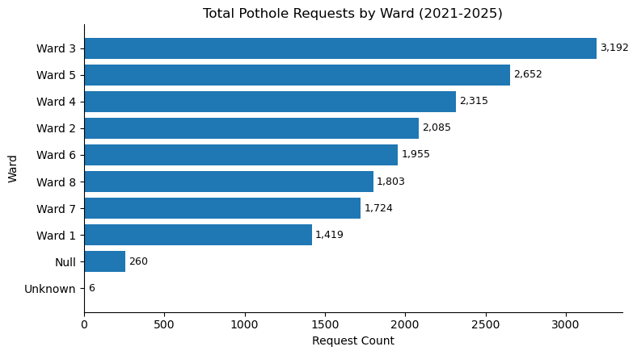

<h1 align="center">DC 311 Pothole Forecasting</h1>


Potholes are a comon urban infrastructure issue, and timely repair is critical for public safety and satisfaction. The DC 311 service request system provides a rich dataset of pothole reports, which can be used to predict future demand for repairs. This project focuses on forecasting the number of pothole repair requests in Washington, DC using historical 311 data and weather information.

### Problem Statement

Given a date $t$, predict the number of pothole requests expected over the next $d$ days using information available up to $t$ (including lagged weather and historical request behavior).

### Primary KPIs and Stakeholders

- **KPIs**:
- MAE (mean absolute error)
- RMSE (root mean squared error)
- Poisson deviance (count-aware error metric)
- Correlation between predictions and true counts (used in some EDA/model-comparison workflows)

- **Stakeholders**:
- DC Department of Public Works (DPW) - for resource allocation and scheduling
- DC residents - for improved service and communication
- City planners - for infrastructure maintenance planning

### Preliminaries before getting started 

To compile and run the code in this repository, you will need to set up a Python environment with the required dependencies. We recommend using a conda environment for ease of package management. You can create and activate the environment using the following command:

```bash
conda create -n dc_pothole_forecasting -f environment.yaml
```

Our data is stored in the `data` folder and is available for use. However, if you wish to preprocess the raw DC 311 CSV files yourself, you can place them in a `csv_data/` folder in the repository. The processed data will be saved in `data/311_data/` for downstream use.

## Exploratory Data Analysis

### 1. Data Acquisition

**NOTE**: If you don't want to use the raw data, skip to Section 2 below! 

The data acquisition process described below is detailed in the [data acquisition notebook](1_data_acquisition.ipynb). We also provide a shorter version [here](2_visualization.ipynb) where we use the functions in `data/` to shorten the workflow. 

We use two primary data sources:

1. DC 311 service request data (pothole-specific)
2. Historical weather data from Open-Meteo

The DC 311 data is accessed from the (Open Data DC)[https://opendata.dc.gov/datasets/] portal, which provides annual CSV exports of all service requests. We filter to those with `SERVICECODEDESCRIPTION == "Pothole"` to get the pothole data. We found that the serivce requests baselines differed significantly across wards, leading us to focus on DC's Ward 3, which has the largest number of pothole service requests.




Raw DC 311 CSV files are expected as annual exports (for example, in a local `csv_data/` folder or another user-provided path). The preprocessing entrypoint is:
- `data/preprocess_311.py`
- function: `preprocess_311(...)`

What it does:
- reads one or multiple raw CSVs,
- filters to `SERVICECODEDESCRIPTION == "Pothole"`,
- validates required columns,
- writes per-ward parquet files to `data/311_data/`,
- returns ward centroids for downstream weather querying.

Example:
```python
from data.preprocess_311 import preprocess_311

out = preprocess_311(
    raw_csv=[
        "csv_data/All_Service_Requests_-_2021.csv",
        "csv_data/311_City_Service_Requests_in_2022.csv",
        "csv_data/All_Service_Requests_-_2023.csv",
    ],
    out_dir="data/311_data",
)
```

For the weather data, we use the Open-Meteo archive API to retrieve historical hourly weather data for the relevant locations and time periods. Since we are interested in the cumulative effect of weather conditions over time, we aggregate the hourly data into daily features. Moreover, we query the weather for the geographical centroid of the ward, which is computed as part of the output of `preprocess_311.py`. The historical weather API allows for the extraction of various weather variables--we extract precipitation, snowfall, and freeze-thaw counts, which are commonly associated with pothole formation and repair demand. The weather retrieval process is designed to be modular and reusable, with query specifications saved as JSON files for reproducibility and caching of results to avoid redundant API calls. A minimal working code snippet is below: 

```python
from data.weather_fetch import write_query_config, fetch_and_save
out = preprocess_311(
    raw_csv=[
        "csv_data/All_Service_Requests_-_2021.csv",
        "csv_data/311_City_Service_Requests_in_2022.csv",
        "csv_data/All_Service_Requests_-_2023.csv",
    ],
    out_dir="data/311_data",
)
cfg_path = write_query_config(
    ward="Ward 3",
    lat=38.92,
    lon=-77.08,
    start_date="2020-12-01",  # buffer period for lag features
    end_date="2025-12-31",
    configs_dir="data/weather_query_configs",
)
df_hourly, meta = fetch_and_save(
    cfg_path,
    cache_dir="data/weather_cache",
    force=False,
)
```

## 2. Data Exploration

A key driver of pothole formation is the [freeze-thaw cycle](https://cnycentral.com/weather/weather-wisdom/pothole-season-explaining-how-the-weather-plays-a-role-in-creating-fixing-potholes) which accounts for the repeated freezing and melting of water that forms and opens cracks in the pavement. A [memo from the Minnesota department of transportation](https://dot.state.mn.us/mnroad/nrra/structure-teams/geotechnical/files/environmental-impacts-tap-meeting-follow-up-freeze-thaw-cycles-comparison-update.pdf) even specifies how to calculate these freeze thaw cycles using hourly temperatures. We implement this in `modeling/features.py` and encapsulated the general feature generation process in the `assemble_features` function within `modeling/features.py`. We also include time series features using a trigonometric encoding of the day of year and day of week indicators, which are implemented in `modeling/data/master.py` as part of the daily feature building process. We also aimed to make our models autoregressive--i.e to use past counts to predict the current counts. We discuss the issues with data leakage and the approach we took to mitigate it in the section below. Our models therefore predict the $d$-day cumulative count of pothole requests $Y^{d}_{t}$ at date $t$, using weather features $X_{t}$, temporal features $\tau_{t}$ and past values of the target variable $Y^{d}_{t-1}, Y^{d}_{t-2}, ..., Y^{d}_{t-k_{AR}}$ as inputs. In particular, we find that the choice of lag and window parameters for the rolling weather features has a significant impact on their correlation with the target pothole counts. To systematically explore this, we perform a small grid-based optimization over a small grid of lag and window parameters to identify which combinations yield the strongest mean absolute correlation with the target variable.


**Hyperparameter Definitions:**
- **d**: Forecast horizon in days
- **d_f**: Rolling window size for freeze-thaw count features (days)
- **d_p**: Rolling window size for precipitation features (days)
- **d_s**: Rolling window size for snowfall features (days)
- **k_AR**: Autoregressive lag window size (number of prior days used as features)
- **l_f**: Lag offset for freeze-thaw count features (days)
- **l_p**: Lag offset for precipitation features (days)
- **l_s**: Lag offset for snowfall features (days)

We comment on the limitations of this process in the limitations section below, but it serves as a critical step in guiding our feature selection and engineering for the modeling phase.

## 3. Modeling and model selection 

We consider three main families of models for forecasting pothole requests:

1. Generalized Linear Models (GLMs) for count data, including Poisson and Negative
Binomial variants.

2. XGBoost with a Poisson objective

3. A hybrid XGB-SARIMA model that trains an XG Boost model and then fits a SARIMA model to the residuals to capture any remaining temporal autocorrelation.

### A note on hyperparameter tuning 

We have 7 main hyperparameters to tune for the data, given by the rolling window size of each weather feature (total precipitation, total FTC's, mean snowfall) and the size of the autoregressive window. We additionally want to train a new model for each forecast horizon (1-day, 3-day, 7-day cumulative counts), which may have different optimal hyperparameters. This leads to a combinatorial explosion of hyperparameter combinations--to circumvent this we use Bayesian optimization to efficiently optimize over the hyperparameter space. In particular, we use the in-built Bayesian optimizer in the Weights & Biases library, which allows us to easily track and compare different runs with different hyperparameter settings. The optimization process is configured in `modeling/search/sweep.py`, where we define the search space for the hyperparameters and the objective function that evaluates model performance based on the chosen KPIs. 

**WARNING** You must have a WandB account and API key to run the Bayesian optimization sweep. You can set up a free account at https://wandb.ai/site and get your API key from your account settings. Once you have your API key, you can set it in your environment variables or directly in the code to enable the sweep functionality. We assume that you have set up your WandB account and API key correctly before running the sweep. If you encounter any issues with WandB integration, please refer to the WandB documentation for troubleshooting steps. In WandB, we first initialize the sweep using the sweep configuration found in `configs/sweep/feature_params.yaml` and then launch a sweep agent (a bunch of parallel processes) that performs the hyperparameter search. A small snippet of code that achieves this is below: 

```bash
wandb sweep configs/sweep/feature_params.yaml --name {YOUR_SWEEP_NAME}
```
After executing this, you get a sweep ID in the output, which you can use to launch the sweep agent:
```bash
python3 modeling/search/sweep.py +sweep_run=default sweep_run.sweep_id{YOUR_SWEEP_ID}
```

A hyperparameter sweep for the Poisson GLM with the 7-day forecast looks like this in the WandB dashboard:


### Best Hyperparameters by Model and Forecast Horizon

The optimal feature engineering hyperparameters identified through Bayesian search for each model and forecast horizon ($d$) are summarized below:


## 4. Model Performance Results

Test set performance across all models and forecast horizons:

**Results for d=1 (1-day forecast)**

| Model | MAE | RMSE | Rel. MAE (%) | Rel. RMSE (%) | Poisson Deviance | Correlation |
|-------|-----|------|--------------|---------------|---------------------|------------|
| GLM Negative Binomial | 1.3525 | 1.85 | 0.488 | 0.5542 | 1.8282 | 0.4859 |
| GLM Poisson | 1.3641 | 1.8761 | 0.4897 | 0.5569 | 1.8747 | 0.4474 |
| XGBoost | 1.3852 | 1.9379 | 0.4991 | 0.5841 | 2.1971 | 0.4034 |
| XGBoost SARIMAX | 1.4025 | 1.9684 | 0.5089 | 0.6138 | 2.3055 | 0.3473 |

**Results for d=5 (5-day forecast)**
| Model | MAE | RMSE | Rel. MAE (%) | Rel. RMSE (%) | Poisson Deviance | Correlation |
|-------|-----|------|--------------|---------------|---------------------|------------|
| GLM Poisson | 4.837 | 6.5543 | 0.4744 | 0.6559 | 4.4537 | 0.6164 |
| GLM Negative Binomial | 4.8353 | 6.5567 | 0.4752 | 0.6577 | 4.4273 | 0.6289 |
| XGBoost SARIMAX | 4.8113 | 6.4203 | 0.5052 | 0.7728 | 4.4361 | 0.6233 |
| XGBoost | 5.0324 | 6.7125 | 0.5126 | 0.722 | 5.2522 | 0.5882 |

**Results for d=7 (7-day forecast)**

| Model | MAE | RMSE | Rel. MAE (%) | Rel. RMSE (%) | Poisson Deviance | Correlation |
|-------|-----|------|--------------|---------------|---------------------|------------|
| GLM Negative Binomial | 6.5126 | 8.731 | 0.4194 | 0.5133 | 5.5558 | 0.6953 |
| GLM Poisson | 6.5728 | 8.7486 | 0.4282 | 0.5273 | 5.7673 | 0.6629 |
| XGBoost | 6.5903 | 8.6644 | 0.45 | 0.5884 | 5.9539 | 0.7005 |
| XGBoost SARIMAX | 6.5989 | 8.6049 | 0.453 | 0.5669 | 6.0111 | 0.6705 |

### Interpreting the results

Across both error (MAE) and alignment with signal shape (correlation), the GLM Negative Binomial model is the strongest overall choice. It achieves the best MAE at $d=1$ and $d=7$, and at $d=5$ it remains extremely close to the top MAE while also having the highest correlation among the four models.

The hyperparameter plot also highlights a clear pattern in the autoregressive term: $k_{AR}=0$ is selected in 10 of 12 best configurations. Only two cases ($d=1$ for XGBoost and XGBoost SARIMAX) prefer nonzero autoregressive depth. This repeated selection of $k_{AR}=0$ suggests that direct autoregressive history is usually not required once lagged/rolling weather and calendar features are included.

Overall, the baseline count-model family remains highly competitive, with the baseline Negative Binomial model still emerging as the best practical model in this study. We also provide a Jupyter notebook (`results.ipynb`) that loads the trained models and generates performance comparison tables and visualizations across the different models and forecast horizons.

## Conclusion

This project demonstrates that relatively simple count-based models, when paired with carefully engineered lagged weather features, can produce useful short-horizon forecasts of pothole service demand. In particular, the Negative Binomial GLM remained a strong and stable baseline across horizons. At the same time, the current pipeline should be viewed as a first step rather than a production-ready citywide forecasting system.

## Limitations and Future Work

### 1. Model limitations

The current model family is limited in its ability to learn long-range temporal dynamics and nonlinear interactions that evolve over time. Future work should include stronger autoregressive deep learning approaches such as RNNs, LSTMs, and transformer-based time-series models, which may better capture sequential dependencies and regime shifts.

### 2. Data coverage limitations

The training window is constrained relative to the full historical 311 record. Ideally, we would train on the entire available history back to 2011 to increase robustness and improve rare-event coverage. In practice, this is complicated by two factors: (1) 2020 is an atypical COVID-era period that may introduce nonstationary behavior, and (2) the historical weather API used here does not extend far enough back to fully align with the oldest 311 records.

### 3. Spatial aggregation limitations

An aggregate ward-level model is only partially actionable because roads differ substantially in degradability, exposure, and maintenance conditions. A more useful formulation is to model pothole formation over the road network itself, where each road segment (or intersection) is represented as a node/edge with evolving features. This motivates future graph-based approaches (graphical models and graph neural networks) for spatiotemporal forecasting.

### 4. Feature limitations

Weather feature coverage is still narrow. This work uses precipitation, snow depth, and freeze-thaw counts, but does not include variables such as soil moisture that may directly affect pavement weakening. Additional non-weather covariates such as traffic intensity and pavement condition would likely improve predictions; however, currently available open datasets for these are often annual, which is too coarse for the daily granularity targeted in this project.
 

## Software Engineering Aspects

### Configuration and reproducibility
- Hydra-based config composition (`configs/` hierarchy)
- deterministic split configuration (`modeling/split.py`)
- run artifacts persisted in `results/<stem>/`

### Modular pipeline design
- data loading/prep: `modeling/data/`
- feature assembly: `modeling/features.py`
- models: `modeling/models/`
- training/eval entrypoints: `modeling/train.py`, `modeling/evaluate.py`
- hyperparameter search: `modeling/search/grid.py`, `modeling/search/bayes.py`

### Data provenance and caching
- weather query specs saved as JSON (`data/weather_query_configs/`)
- fetched weather cached with metadata (`data/weather_cache/`)
- 311 preprocessing outputs stored by ward and date range (`data/311_data/`)

### Experiment tracking
- optional Weights & Biases integration via config (`wandb.enabled`)

