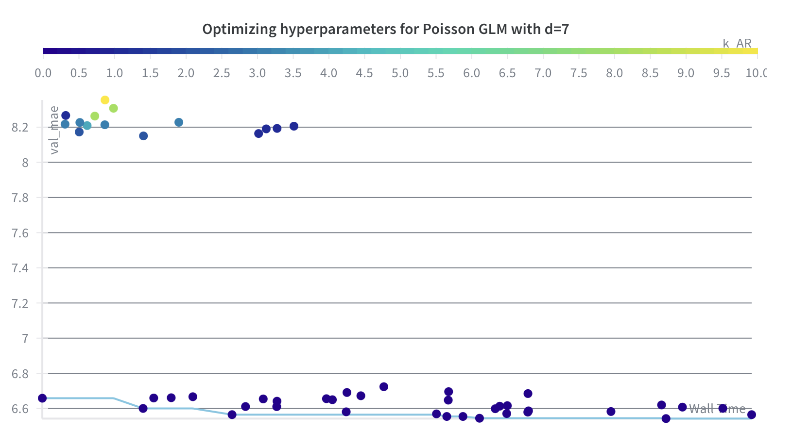
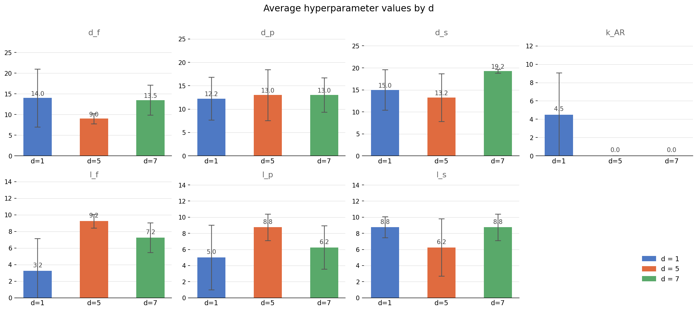

<h1 align="center">DC 311 Pothole Forecasting</h1>


Potholes are a comon urban infrastructure issue, and timely repair is critical for public safety and satisfaction. The DC 311 service request system provides a rich dataset of pothole reports, which can be used to predict future demand for repairs. This project focuses on forecasting the number of pothole repair requests in Washington, DC using historical 311 data and weather information.

### Problem Statement

Given a date $t$, predict the number of pothole requests expected over the next $d$ days using information available up to $t$ (including lagged weather and historical request behavior).

### Primary KPIs and Stakeholders

- **KPIs**:
- MAE (mean absolute error)
- RMSE (root mean squared error)
- Poisson deviance (count-aware error metric)
- Correlation between predictions and true counts (used in some EDA/model-comparison workflows)

- **Stakeholders**:
- DC Department of Public Works (DPW) - for resource allocation and scheduling
- DC residents - for improved service and communication
- City planners - for infrastructure maintenance planning

### Preliminaries before getting started 

To compile and run the code in this repository, you will need to set up a Python environment with the required dependencies. We recommend using a conda environment for ease of package management. You can create and activate the environment using the following command:

```bash
conda env create -n dc_pothole_forecasting -f environment.yml
conda activate dc_pothole_forecasting
```

We include a `pyproject.toml` file for compiling this repository as a package so you may make local imports from the `data/` and `modeling/` modules in the Jupyter notebooks. To install the package in editable mode, run:

```bash
pip install -e .
```
Our data is stored in the `data` folder and is available for use. However, if you wish to preprocess the raw DC 311 CSV files yourself, you can place them in a `csv_data/` folder in the repository. The processed data will be saved in `data/311_data/` for downstream use.

## Exploratory Data Analysis

### 1. Data Acquisition

**NOTE**: If you don't want to use the raw data, skip to Section 2 below! 

The data acquisition process described below is detailed in the [data acquisition notebook](1_data_acquisition.ipynb). We also provide a shorter visualization workflow [here](2_visualize_time_series.ipynb) where we use the functions in `data/` to shorten the workflow.

We use two primary data sources:

1. DC 311 service request data (pothole-specific)
2. Historical weather data from Open-Meteo

The DC 311 data is accessed from the (Open Data DC)[https://opendata.dc.gov/datasets/] portal, which provides annual CSV exports of all service requests. We filter to those with `SERVICECODEDESCRIPTION == "Pothole"` to get the pothole data. We found that the serivce requests baselines differed significantly across wards, leading us to focus on DC's Ward 3, which has the largest number of pothole service requests.


<!--  -->

Raw DC 311 CSV files are expected as annual exports (for example, in a local `csv_data/` folder or another user-provided path). The preprocessing entrypoint is:
- `data/preprocess_311.py`
- function: `preprocess_311(...)`

What it does:
- reads one or multiple raw CSVs,
- filters to `SERVICECODEDESCRIPTION == "Pothole"`,
- validates required columns,
- writes per-ward parquet files to `data/311_data/`,
- returns ward centroids for downstream weather querying.

Example:
```python
from data.preprocess_311 import preprocess_311

out = preprocess_311(
    raw_csv=[
        "csv_data/All_Service_Requests_-_2021.csv",
        "csv_data/311_City_Service_Requests_in_2022.csv",
        "csv_data/All_Service_Requests_-_2023.csv",
    ],
    out_dir="data/311_data",
)
```

For the weather data, we use the Open-Meteo archive API to retrieve historical hourly weather data for the relevant locations and time periods. Since we are interested in the cumulative effect of weather conditions over time, we aggregate the hourly data into daily features. Moreover, we query the weather for the geographical centroid of the ward, which is computed as part of the output of `preprocess_311.py`. The historical weather API allows for the extraction of various weather variables--we extract precipitation, snowfall, and freeze-thaw counts, which are commonly associated with pothole formation and repair demand. The weather retrieval process is designed to be modular and reusable, with query specifications saved as JSON files for reproducibility and caching of results to avoid redundant API calls. A minimal working code snippet is below: 

```python
from data.weather_fetch import write_query_config, fetch_and_save
out = preprocess_311(
    raw_csv=[
        "csv_data/All_Service_Requests_-_2021.csv",
        "csv_data/311_City_Service_Requests_in_2022.csv",
        "csv_data/All_Service_Requests_-_2023.csv",
    ],
    out_dir="data/311_data",
)
cfg_path = write_query_config(
    ward="Ward 3",
    lat=38.92,
    lon=-77.08,
    start_date="2020-12-01",  # buffer period for lag features
    end_date="2025-12-31",
    configs_dir="data/weather_query_configs",
)
df_hourly, meta = fetch_and_save(
    cfg_path,
    cache_dir="data/weather_cache",
    force=False,
)
```

## 2. Data Exploration

A key driver of pothole formation is the [freeze-thaw cycle](https://cnycentral.com/weather/weather-wisdom/pothole-season-explaining-how-the-weather-plays-a-role-in-creating-fixing-potholes) which accounts for the repeated freezing and melting of water that forms and opens cracks in the pavement. A [memo from the Minnesota department of transportation](https://dot.state.mn.us/mnroad/nrra/structure-teams/geotechnical/files/environmental-impacts-tap-meeting-follow-up-freeze-thaw-cycles-comparison-update.pdf) even specifies how to calculate these freeze thaw cycles using hourly temperatures. We implement this in `modeling/features.py` and encapsulated the general feature generation process in the `assemble_features` function within `modeling/features.py`. We also include time series features using a trigonometric encoding of the day of year and day of week indicators, which are implemented in `modeling/data/master.py` as part of the daily feature building process. We find that the choice of lag and window parameters for the rolling weather features has a significant impact on their correlation with the target pothole counts. To systematically explore this, in this [notebook](3_eda.ipynb)we perform a small grid-based optimization over a small grid of lag and window parameters to identify which combinations yield the strongest mean absolute correlation with the target variable.


**Hyperparameter Definitions:**
- **d**: Forecast horizon in days
- **d_f**: Rolling window size for freeze-thaw count features (days)
- **d_p**: Rolling window size for precipitation features (days)
- **d_s**: Rolling window size for snowfall features (days)
- **d_sm07**: Rolling window size for soil moisture 0-7cm (days)
- **d_sm728**: Rolling window size for soil moisture 7-28cm (days)
- **k_AR**: Autoregressive lag window size (number of prior days used as features)
- **l_f**: Lag offset for freeze-thaw count features (days)
- **l_p**: Lag offset for precipitation features (days)
- **l_s**: Lag offset for snowfall features (days)
- **l_sm07**: Lag offset for soil moisture 0-7cm (days)
- **l_sm728**: Lag offset for soil moisture 7-28cm (days)

## 3. Modeling and model selection 

We consider the following families of models for forecasting pothole requests:

1. Naive weakly and yearly baselines, 

2. Seasonal and simple random walk, 

3. Generalized Linear Models (GLMs) for count data, including Poisson and Negative
Binomial variants,

4. Regularized linear models with L2 and L1 regularization, and

3. XGBoost. 

We discuss the loading, training, and evaluation of these models in [this notebook](4_modeling.ipynb). A key aspect of our modeling approach is that our models are autoregressive--i.e they use lagged values of the target variable as features. 

### Handling data leakage

1. When using autoregressive features, our models must use values $Y_{t-1}, ..., Y_{t - k_{AR}}$ as features. However since $Y_{t}$ represents sum of requests up to time $t + (d-1)$, at inference time we do not have access to these features beyond $Y_{t-d}$. The solution to this problem is that at inference, to compute predictions from $t$ up to the horizon $t + h$, we start predicting from $Y_{t-(d-1)}$ and use the sequentially computed values as features for the next prediction. This causes an inherent accumulation of errors during the prediction process as $d$ gets larger, but ensures that we never "look into the future" when predicting. 

2. The lagged weather features face a similar issue: due to the above autoregressive rollout prediction strategy, the model rolls out from $Y_{t-(d-1)}$ up to $Y_{(t+(h-1))}$, leading to a total rollout of $h_{eval} = d + h - 1$. Here $h_{eval}$ is the evaluation horizon and to avoid computing weather features from the future, the lag of any weather variable has to be kept at least $h_{eval}$. 

### A note on hyperparameter tuning 

We have 11 main hyperparameters to tune for the data, given by the rolling window size of each weather feature (total precipitation, total FTC's, mean snowfall, two soil moisture readings) and the size of the autoregressive window. We additionally want to train a new model for each forecast horizon (1-day, 3-day, 7-day cumulative counts), which may have different optimal hyperparameters. This leads to a combinatorial explosion of hyperparameter combinations--to circumvent this we use Bayesian optimization to efficiently optimize over the hyperparameter space. In particular, we use the in-built Bayesian optimizer in the Weights & Biases library, which allows us to easily track and compare different runs with different hyperparameter settings. The optimization process is configured in `modeling/search/sweep.py`, where we define the search space for the hyperparameters and the objective function that evaluates model performance based on the chosen KPIs. 

**WARNING** You must have a WandB account and API key to run the Bayesian optimization sweep. You can set up a free account at https://wandb.ai/site and get your API key from your account settings. Once you have your API key, you can set it in your environment variables or directly in the code to enable the sweep functionality. We assume that you have set up your WandB account and API key correctly before running the sweep. If you encounter any issues with WandB integration, please refer to the WandB documentation for troubleshooting steps. In WandB, we first initialize the sweep using the sweep configuration found in `configs/sweep/feature_params.yaml` and then launch a sweep agent (a bunch of parallel processes) that performs the hyperparameter search. A small snippet of code that achieves this is below: 

```bash
wandb sweep configs/sweep/feature_params.yaml --name {YOUR_SWEEP_NAME}
```
After executing this, you get a sweep ID in the output, which you can use to launch the sweep agent:
```bash
python3 modeling/search/sweep.py +sweep_run=default sweep_run.sweep_id{YOUR_SWEEP_ID}
```

A hyperparameter sweep for the Poisson GLM with the 7-day forecast looks like this in the WandB dashboard:



### Best Hyperparameters by Model and Forecast Horizon

The optimal feature engineering hyperparameters identified through Bayesian search for each model and forecast horizon ($d$) are summarized below:



### Model training process

While we walk through the full training pipeline in [this notebook](4_modeling.ipynb) we use [Hydra](https://hydra.cc/) to manage the many different configurations for data processing, feature engineering, model training, and hyperparameter search. All configurations are stored in the `configs/` directory with a clear hierarchy (for example, `configs/model/` for model-specific configs and `configs/features/` for feature engineering configs). This allows us to easily reproduce experiments and maintain a clear record of the settings used for each run, simplifying model training to a single command. 

```bash
python3 modeling/train.py
```

This trains a model and saves it to the results directory using the default parameters in `configs/config.yaml`. If you want to train your own model (say an XGB model with a 3 day autoregressive window), you would run: 

```bash
python3 modeling/train.py +model=xgb +features.k_AR=3
```

Look up Hydra override syntax [here](https://hydra.cc/docs/next/advanced/override_grammar/basic) for more details on how to specify different parameters.

## 4. Model Performance Results

The current results notebook evaluates strict no-leakage runs on the fixed `first_week_2025` split. The test window is `2025-01-01` to `2025-01-07`, with one daily forecast row per date (`d=1`). The comparison includes `xgb`, `xgb_sarimax`, `poisson_glm`, `negbin_glm`, `naive_last_year`, and `naive_last_week`.

| Model | MAE | RMSE | Rel. MAE (%) | Rel. RMSE (%) | Poisson Deviance |
|---|---:|---:|---:|---:|---:|
| xgb | 0.8453 | 1.3013 | 0.3328 | 0.4488 | 1.4202 |
| xgb_sarimax | 0.8527 | 1.3027 | 0.3396 | 0.4505 | 1.4224 |
| poisson_glm | 1.3195 | 1.6757 | 0.2299 | 0.3482 | 2.2514 |
| negbin_glm | 1.3374 | 1.6824 | 0.2398 | 0.3503 | 2.2583 |
| naive_last_year | 1.4286 | 1.8516 | 0.7500 | 0.9354 | 1.7058 |
| naive_last_week | 1.6480 | 2.0128 | 0.6250 | 0.7500 | 33.2508 |

The naive baseline checks confirm that `naive_last_year` exactly matches its calendar-reference rule for all 7 test days, while `naive_last_week` matches its rule for 6 of 7 test days.

Because this final test window covers only one calendar week, these results should be interpreted as a strict no-leakage snapshot rather than a full estimate of year-round generalization.

### Interpreting the results

On the current strict first-week-2025 evaluation, `xgb` is the best model by both MAE and RMSE. The `xgb_sarimax` hybrid is very close, but it does not improve over plain `xgb` on this short evaluation window.

The loaded runs in `5_results.ipynb` use the same feature configuration across all six models: $d=1$, $d_p=15$, $l_p=10$, $d_s=15$, $l_s=0$, $d_f=15$, $l_f=0$, and $k_{AR}=0$. This means the current first-week-2025 comparison uses daily one-step forecasts without direct autoregressive target lags.

Overall, the GLM models remain useful, interpretable baselines, but they are no longer the top performers in the latest notebook results. The naive baselines are included as leakage-checked references, and the latest performance comparison is generated in `5_results.ipynb`.

## Conclusion

This project demonstrates that models using carefully engineered lagged weather and calendar features can produce useful short-horizon forecasts of pothole service demand. In the latest strict first-week-2025 evaluation, XGBoost achieves the strongest MAE and RMSE, while GLM count models remain interpretable baselines. At the same time, the current pipeline should be viewed as a first step rather than a production-ready citywide forecasting system.

## Limitations and Future Work

### 1. Model limitations

The current model family is limited in its ability to learn long-range temporal dynamics and nonlinear interactions that evolve over time. Future work should include stronger autoregressive deep learning approaches such as RNNs, LSTMs, and transformer-based time-series models, which may better capture sequential dependencies and regime shifts.

### 2. Data coverage limitations

The training window is constrained relative to the full historical 311 record. Ideally, we would train on the entire available history back to 2011 to increase robustness and improve rare-event coverage. In practice, this is complicated by two factors: (1) 2020 is an atypical COVID-era period that may introduce nonstationary behavior, and (2) the historical weather API used here does not extend far enough back to fully align with the oldest 311 records.

### 3. Spatial aggregation limitations

An aggregate ward-level model is only partially actionable because roads differ substantially in degradability, exposure, and maintenance conditions. A more useful formulation is to model pothole formation over the road network itself, where each road segment (or intersection) is represented as a node/edge with evolving features. This motivates future graph-based approaches (graphical models and graph neural networks) for spatiotemporal forecasting.

### 4. Feature limitations

Weather feature coverage is still narrow. This work uses precipitation, snow depth, and freeze-thaw counts, but does not include variables such as soil moisture that may directly affect pavement weakening. Additional non-weather covariates such as traffic intensity and pavement condition would likely improve predictions; however, currently available open datasets for these are often annual, which is too coarse for the daily granularity targeted in this project.
 

## Software Engineering Aspects

### Configuration and reproducibility
We use hydra-based config composition to keep track of the many different configurations for data processing, feature engineering, model training, and hyperparameter search. All configurations are stored in the `configs/` directory with a clear hierarchy (for example, `configs/model/` for model-specific configs and `configs/features/` for feature engineering configs). This allows us to easily reproduce experiments and maintain a clear record of the settings used for each run.

### Modular pipeline design

We keep the data acquisition code completely separate in `data/`. Once the data is processed, the user can safely switch to machine learning. 

### Scripts for querying the weather API

For the ease of querying the weather API, we provide scripts `data/weather_fetch.py` which includes functions for writing query configurations and fetching/saving weather data based on those configurations. This modular design allows for easy reuse and adaptation of the weather querying process for different locations, time periods, or weather variables. This module is of independent interest to anyone intending to use the Open-Meteo historical weather API for similar applications.

### Experiment tracking
- Optional Weights & Biases integration via config (`wandb.enabled`)

## Repository Organization (Tree)

```text
spring-2026-dc-311/
|-- README.md
|-- pyproject.toml
|-- requirements.txt
|-- environment.yml
|-- 1_data_acquisition.ipynb
|-- 2_visualize_time_series.ipynb
|-- 3_eda.ipynb
|-- 4_modeling.ipynb
|-- 5_results.ipynb
|-- assets/
|   |-- hyperparameter_averages.png
|   |-- hyperparameter_search.png
|   |-- lag_discovery.png
|   |-- service_requests_distribution.png
|-- configs/
|   |-- config.yaml
|   |-- debug/
|   |   `-- default.yaml
|   |-- features/
|   |   |-- best_glm_negbin_d_1.yaml
|   |   |-- best_glm_negbin_d_5.yaml
|   |   |-- best_glm_negbin_d_7.yaml
|   |   |-- best_glm_poisson_d_1.yaml
|   |   |-- best_glm_poisson_d_5.yaml
|   |   |-- best_glm_poisson_d_7.yaml
|   |   |-- best_xgb_d_1.yaml
|   |   |-- best_xgb_d_5.yaml
|   |   |-- best_xgb_d_7.yaml
|   |   |-- best_xgb_sarimax_d_1.yaml
|   |   |-- best_xgb_sarimax_d_5.yaml
|   |   |-- best_xgb_sarimax_d_7.yaml
|   |   `-- default.yaml
|   |-- model/
|   |   |-- glm.yaml
|   |   |-- glm_poisson.yaml
|   |   |-- lgbm.yaml
|   |   |-- mymodel.yaml
|   |   |-- naive_weekly.yaml
|   |   |-- naive_yearly.yaml
|   |   |-- xgb.yaml
|   |   `-- xgb_sarimax.yaml
|   |-- split/
|   |   |-- default.yaml
|   |   |-- first_week_2025.yaml
|   |   `-- temporal.yaml
|   |-- sweep/
|   |-- sweep_run/
|   |-- wandb/
|   `-- ward/
|-- data/
|   |-- preprocess_311.py
|   |-- weather_fetch.py
|   |-- 311_data/
|   |-- weather_cache/
|   `-- weather_query_configs/
|-- modeling/
|   |-- __init__.py
|   |-- evaluate.py
|   |-- features.py
|   |-- metrics.py
|   |-- split.py
|   |-- train.py
|   |-- data/
|   |-- models/
|   `-- search/
|-- outputs/
`-- results/
```
